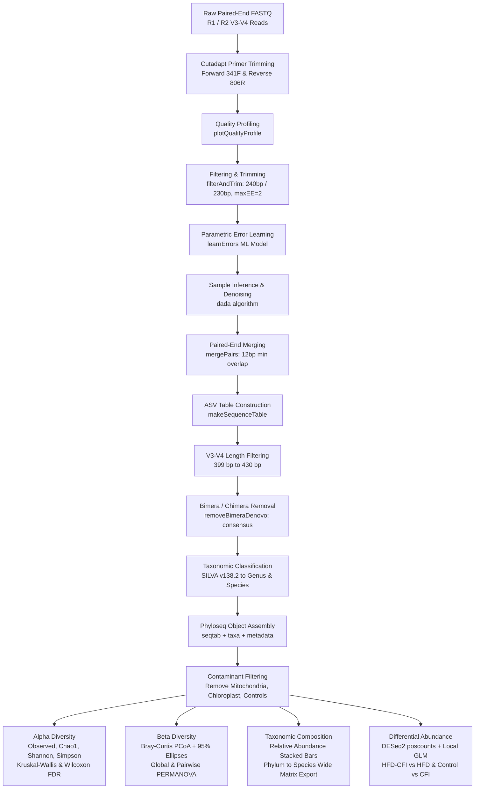

# 16S rRNA Amplicon Sequencing (V3–V4) Analysis Pipeline

[](https://www.r-project.org/)
[](https://cutadapt.readthedocs.io/)
[](https://bioconductor.org/packages/release/bioc/html/dada2.html)
[](https://bioconductor.org/packages/release/bioc/html/phyloseq.html)
[](https://bioconductor.org/packages/release/bioc/html/DESeq2.html)
[](https://cran.r-project.org/package=vegan)
[](LICENSE)

An end-to-end, publication-grade bioinformatic and statistical workflow for high-throughput **16S rRNA gene amplicon sequencing (hypervariable regions V3–V4)**. 

This repository provides an automated, reproducible workflow spanning:
1. **Raw Read Demultiplexing & Primer Trimming (Cutadapt)** to remove Illumina V3–V4 specific primers.
2. **High-Resolution Denoising & ASV Inference (DADA2)** resolving exact biological sequence variants down to single-nucleotide differences.
3. **Taxonomic Annotation (SILVA v138.2)** from Kingdom down to Genus and exact Species assignments.
4. **Phyloseq Object Assembly & Contaminant Filtering** (removing host organelles and non-target taxa).
5. **Alpha Diversity Ecology** (Observed, Chao1, Shannon, Simpson indices with Kruskal-Wallis & FDR-corrected Wilcoxon tests).
6. **Beta Diversity & Community Structure** (Bray-Curtis dissimilarity, PCoA ordination with 95% confidence ellipses, and global/pairwise PERMANOVA via `adonis2`).
7. **Relative Abundance Profiling** (automated multi-taxonomic rank aggregation and wide-format matrix generation).
8. **Negative Binomial Differential Abundance Analysis (DESeq2)** using `poscounts` size-factor adjustments for sparse microbiome count data.

---

## Table of Contents

- [Overview & Experimental Context](#overview--experimental-context)
- [Workflow Architecture](#workflow-architecture)
- [Pipeline Stages & Technical Details](#pipeline-stages--technical-details)
  - [Step 0: Primer Trimming (Cutadapt)](#step-0-primer-trimming-cutadapt)
  - [Step 1: Quality Profiling & DADA2 Filter/Trim](#step-1-quality-profiling--dada2-filtertrim)
  - [Step 2: Error Modeling & Sample Inference (DADA2)](#step-2-error-modeling--sample-inference-dada2)
  - [Step 3: Pair Merging, Length Validation, and Chimera Removal](#step-3-pair-merging-length-validation-and-chimera-removal)
  - [Step 4: Taxonomic Assignment (SILVA v138.2)](#step-4-taxonomic-assignment-silva-v1382)
  - [Step 5: Phyloseq Integration & Contaminant Filtering](#step-5-phyloseq-integration--contaminant-filtering)
  - [Step 6: Alpha Diversity Analysis](#step-6-alpha-diversity-analysis)
  - [Step 7: Beta Diversity & Multivariate Community Ecology](#step-7-beta-diversity--multivariate-community-ecology)
  - [Step 8: Taxonomic Composition & Abundance Export](#step-8-taxonomic-composition--abundance-export)
  - [Step 9: Differential Abundance Testing (DESeq2)](#step-9-differential-abundance-testing-deseq2)
- [Repository Structure](#repository-structure)
- [Installation & Prerequisites](#installation--prerequisites)
- [Input Data Requirements](#input-data-requirements)
- [Usage Guide](#usage-guide)
- [Expected Outputs & Deliverables](#expected-outputs--deliverables)
- [Author & Citation Information](#author--citation-information)
- [License](#license)

---

## Overview & Experimental Context

Amplicon sequencing of the 16S ribosomal RNA hypervariable regions **V3–V4** is a cornerstone for profiling bacterial communities in environmental and biomedical ecosystems. Unlike traditional 97% OTU clustering methods that bin distinct bacterial strains together, this pipeline employs **DADA2** to infer exact **Amplicon Sequence Variants (ASVs)**.

### Experimental Study Design (CFI Study)
The pipeline is demonstrated on a gut microbiome dataset investigating the physiological and microbiome-modulating effects of a dietary intervention (**CFI** / Caffeine intervention) in mouse models under standard and high-fat diet conditions:
- **Control**: Baseline standard diet controls.
- **Control-CFI**: Healthy controls receiving dietary intervention (identifying baseline intervention effects).
- **HFD**: High-Fat Diet-induced obesity and dysbiosis model.
- **HFD-CFI**: High-Fat Diet mice receiving dietary intervention (evaluating microbiome rescue / therapeutic effects).
- **Negative & Positive Controls**: Sequencing and extraction controls used for quality auditing, subsequently filtered out prior to biological evaluations.

---

## Workflow Architecture



---

## Pipeline Stages & Technical Details

### Step 0: Primer Trimming (Cutadapt)
Located in `Cutadapt for 16srRNA analysis/`:
- Raw Illumina sequencing reads contain non-biological primers targeting the V3–V4 region:
  - **Forward (341F)**: `CCTACGGGNGGCWGCAG` (or `^CCTAYGGGDBGCWGCAG`)
  - **Reverse (806R)**: `GGACTACNVGGGTWTCTAAT` (or `^GACTACNVGGGTMTCTAATCC`)
- Uses `cutadapt` to strip primers, discarding untrimmed reads (`--discard-untrimmed`) and prefixing output with `trim_`.

### Step 1: Quality Profiling & DADA2 Filter/Trim
- Inspects per-base quality scores (`plotQualityProfile`) across cycles.
- Runs `filterAndTrim` with optimized cutoffs for V3–V4 amplicons:
  - `truncLen = c(240, 230)` (maintains sufficient overlap for merging while clipping degraded 3' tail ends).
  - `maxEE = c(2, 2)` (maximum allowed expected errors).
  - `truncQ = 2` (truncates reads at the first instance of low-quality scores).
  - `rm.phix = TRUE` (removes Illumina PhiX spike-in).

### Step 2: Error Modeling & Sample Inference (DADA2)
- Learns the run-specific error rates using machine-learning parametric models (`learnErrors`, `plotErrors`).
- Applies sample inference (`dada`) with single-nucleotide resolution to distinguish real biological variants from sequencer miscalls.

### Step 3: Pair Merging, Length Validation, and Chimera Removal
- Merges forward and reverse denoised pairs (`mergePairs`).
- Assembles the initial Amplicon Sequence Variant (ASV) count table (`makeSequenceTable`).
- Enforces strict biological amplicon length bounds (`399:430 bp`), discarding non-specific PCR artifacts.
- Identifies and discards PCR chimeras de novo (`removeBimeraDenovo`, `method = "consensus"`).
- Tracks read progression and survival percentage across all stages (`track`).

### Step 4: Taxonomic Assignment (SILVA v138.2)
- Classifies ASVs from Kingdom down to Genus via the SILVA v138.2 training set (`assignTaxonomy`, RDP naive Bayesian classifier).
- Assigns exact binomial species names where available (`addSpecies`).

### Step 5: Phyloseq Integration & Contaminant Filtering
- Consolidates the ASV count matrix, sample metadata (`CFI metadata.csv`), and taxonomy table into a unified `phyloseq` object.
- Filters out non-bacterial or organellar DNA:
  - Excludes Family **Mitochondria**.
  - Excludes Order **Chloroplast**.
  - Excludes unassigned phyla.
- Subsets experimental animals away from sequencing controls (`ps.mice`).

### Step 6: Alpha Diversity Analysis
- Computes within-sample richness and diversity indices:
  - **Observed ASVs** (total richness)
  - **Chao1** (richness adjusted for undetected rare taxa)
  - **Shannon Index** (accounts for richness and evenness)
  - **Simpson Index** (measures dominance)
- Generates publication-ready boxplots faceted by treatment group (`ggplot2`).
- Computes non-parametric statistical metrics:
  - Global **Kruskal-Wallis** test across all groups.
  - Post-hoc pairwise **Wilcoxon rank-sum tests** with Benjamini-Hochberg (BH/FDR) correction.

### Step 7: Beta Diversity & Multivariate Community Ecology
- **Noise reduction**: Filters out ultra-low abundance ASVs (< 10 reads overall) and enforces prevalence in $\ge 2$ samples.
- Computes Bray-Curtis dissimilarity distance matrices and performs Principal Coordinates Analysis (PCoA).
- Produces PCoA scatter plots with 95% confidence multivariate ellipses (`stat_ellipse(type = "t")`).
- Performs hypothesis testing:
  - Global **PERMANOVA** (`vegan::adonis2`, 999 permutations).
  - Pairwise PERMANOVA tests:
    - `Control vs Control-CFI` ($p = 0.032$): Quantifies baseline microbiota shifts induced by the intervention.
    - `HFD vs HFD-CFI` ($p = 0.040$): Evaluates therapeutic restructuring in diet-induced dysbiosis.

### Step 8: Taxonomic Composition & Abundance Export
- Applies Total Sum Scaling (TSS) transformation to calculate relative abundances.
- Agglomerates taxa at each canonical rank (`tax_glom`): Phylum, Class, Order, Family, Genus, Species.
- Builds faceted stacked bar plots (`facet_grid(~Group)`).
- Implements an automated export routine (`export_wide_taxonomy`) generating tidy wide-format abundance tables with metadata for downstream manuscript generation.

### Step 9: Differential Abundance Testing (DESeq2)
- Converts raw counts to a DESeq2 dataset (`phyloseq_to_deseq2`).
- Applies `poscounts` size factor estimation specifically tailored for sparse 16S amplicon data.
- Fits generalized linear models (GLMs) using local dispersion estimates (`fitType = "local"`).
- Extracts and annotates statistically significant biomarkers ($\text{padj} < 0.05$) sorted by $\log_2(\text{Fold Change})$ across:
  - `HFD-CFI vs HFD`
  - `Control-CFI vs Control`
  - `HFD vs Control-CFI`

---

## Repository Structure

```text
16S-rRNA-Seq-v3-v4-analysis/
├── 16S rRNA V3-V4 R codes/
│   └── CFI 16s data analysis.R          # Comprehensive R script (DADA2, Phyloseq, DESeq2)
├── Cutadapt for 16srRNA analysis/
│   ├── cutadapt bash script.txt          # Reference bash commands and notes
│   └── trim_16s.sh                       # Executable shell script for batch primer trimming
├── .gitignore                           # Excludes FASTQ, raw databases, and session caches
├── LICENSE                              # MIT License
└── README.md                            # Comprehensive workflow and project documentation
```

---

## Installation & Prerequisites

### 1. Conda Environment for Cutadapt
```bash
conda create -n cutadapt_env -c bioconda cutadapt -y
conda activate cutadapt_env
```

### 2. R Environment (R >= 4.0.0)
```r
# Install BiocManager if not already present
if (!requireNamespace("BiocManager", quietly = TRUE))
    install.packages("BiocManager")

# Install core Bioconductor packages
BiocManager::install(c("dada2", "phyloseq", "DESeq2"))

# Install CRAN packages
install.packages(c("ggplot2", "dplyr", "tidyr", "vegan"))
```

### 3. SILVA Reference Databases
Download the SILVA v138.2 reference training datasets and place them in your working directory:
- [silva_nr99_v138.2_toGenus_trainset.fa.gz](https://zenodo.org/records/10700595)
- [silva_v138.2_assignSpecies.fa.gz](https://zenodo.org/records/10700595)

---

## Input Data Requirements

1. **Demultiplexed Paired-End FASTQ Files**:
   - Forward reads: `<sample_id>_R1_001.fastq.gz`
   - Reverse reads: `<sample_id>_R2_001.fastq.gz`
2. **Sample Metadata File (`CFI metadata.csv`)**:
   - Sample row names matching FASTQ sample IDs.
   - Key columns: `Sample`, `Name`, `Group` (`Control`, `Control-CFI`, `HFD`, `HFD-CFI`, `Negative`, `Positive`).

---

## Usage Guide

1. **Clone the repository**:
   ```bash
   git clone https://github.com/taiwo65-codes/16S-rRNA-Seq-v3-v4-analysis.git
   cd 16S-rRNA-Seq-v3-v4-analysis
   ```

2. **Trim primers**:
   ```bash
   cd "Cutadapt for 16srRNA analysis"
   bash trim_16s.sh
   cd ..
   ```

3. **Run R analysis**:
   - Open `16S rRNA V3-V4 R codes/CFI 16s data analysis.R` in RStudio.
   - Adjust `path <- "/path/to/your/files"` to your data directory.
   - Run sections sequentially.

---

## Expected Outputs & Deliverables

| Category | File Name | Description |
| :--- | :--- | :--- |
| **Trimmed Reads** | `trim_*_R1_001.fastq.gz` | Primer-trimmed FASTQ paired-end reads |
| **DADA2 Counts** | `seqtab_dada2_raw.rds` | Cleaned ASV count abundance matrix |
| **Taxonomy Table** | `taxa_dada2_raw.rds` | SILVA v138.2 taxonomic classifications |
| **Alpha Diversity** | `alpha_diversities_complete.csv` | Observed, Chao1, Shannon, Simpson indices per sample |
| **Taxonomic Profiles** | `phylum_rel_abundance_wide.csv` | Wide-format relative abundance across samples at Phylum level |
| | `*_rel_abundance_wide.txt` | Wide-format abundance tables for Class, Order, Family, Genus, Species |
| **Differential Abundance** | `DESeq2_HFD_vs_HFD-CFI.csv` | Differentially abundant taxa in HFD with CFI rescue ($\text{padj} < 0.05$) |
| | `DESeq2_Control_vs_Control-CFI.csv` | Differentially abundant taxa in healthy controls with CFI |
| | `DESeq2_Control-CFI_vs_HFD.csv` | Differentially abundant taxa between control-treated and HFD |

---

## Author & Citation Information

- **Author**: **Taiwo Bankole**
- **GitHub**: [@taiwo65-codes](https://github.com/taiwo65-codes)
- **Repository**: [16S-rRNA-Seq-v3-v4-analysis](https://github.com/taiwo65-codes/16S-rRNA-Seq-v3-v4-analysis)

---

## License

This project is licensed under the [MIT License](LICENSE) - feel free to adapt and use for academic and research workflows.
